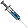
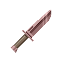
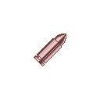

# Sprites

> As a general rule of thumb, please check the current sprites to gain an idea of our art style.

- 128x128 (canvas size; the object does not have to take all space - the larger the sexier though!)
- transparent background
- pixel-art (1x1 pixels)
- PNG format
- realistic style
- without strong outlines
- small palettes

[Back to README](README.md)
