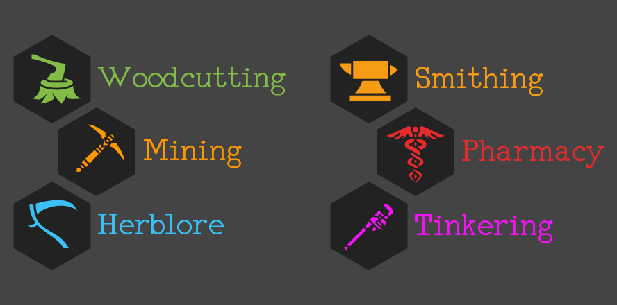
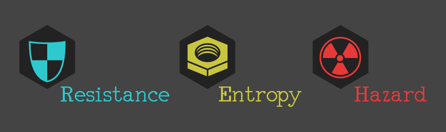

# Project Cordon

> Project Cordon is a post-apocalyptic incremental browser game with RPG element galore.

The idea was born in April, 2017 after burning countless hours by playing idler-incremental games. Addictive by their nature, such games will give you the illusion you are making progress. Totally effortless progress, as the game will play itself and your numbers (cookies, candies, romances with anime girls) will keep increasing. You check on it twice a day to see how much has been done, and it will always up your level of satisfactory. This has to be the biggest scam since Bitcoin, right?

That is the main concept Project Cordon is built on - set in a post-apocalyptic world. We envision a rich arsenal of modern firearms and close combat weapons, armor pieces such as kevlars and gas masks - all to stand a change against hordes of anomalous creatures of the wastelands. Axes, picks, hammers, scythes, bonesaws and wrenches - tools to build and craft from what is left after the apocalypse, supported by researchable blueprints and recipes. The goods produced fuel the market and economy of the world completely.

The radiation and mutants are not the only sources of harm in Project Cordon. The survivors of the apocalypse formed three factions with conflicting goals, interests and discliplines. This makes a restless battle between the three - with the effort to conquer strategic points, sabotage others' infrastrucutre and demand drastical tax. Their - namingly the Resistance, Entropy, and Hazard - only mutual interest is to repel global attacks and prevent irreversible damage to the ecosystem in the dynamic world of Project Cordon.

